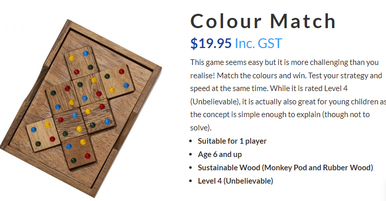
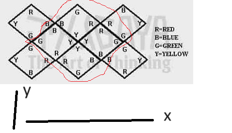

# Colour Match 8 Piece Puzzle
# The Problem
Source:\
https://wolfpack.games/product/colour-match/

All cubes consist of the face you see being up having four dots of Red, Blue, Yellow, Green in different configurations whether some are the same or not.

These eight cubes are to be put into the tray so that the dots on each side of the cube match with an adjoining cube.
The tray contains 8 places for the cubes and the cubes can be oriented in any direction with the colours on top.

# Approach

The shape is interesting and looks like a knot.
I tried to break this into the following steps:
- Finding the central 2 by 2 diamond
- Finding the left two tiles connecting to the diamond's left
- Finding the right two tiles connecting to the diamond's right

### Finding the central 2 by 2 diamond
Check different combinations of fours tiles.
Use backtracking with recursion.
Add to the result list if they satisfy the diamond constraint.
The four touching sides inside the diamond have to match the same colour dots.
Rotate the tiles to explore more opportunities (four times of 90-degree rotation).

### Finding the left two tiles connecting to the diamond's left
Check what two tiles match the left tile of the diamond.
Use backtracking with recursion.
Add to the result list if they satisfy the constraint.
Note we take out the four used tiles, so only fours tiles are checked.
Rotate the tiles to explore more opportunities (four times of 90-degree rotation).

### Finding the left two tiles connecting to the diamond's right
Up to this stage, we have only two tiles left.
Check the two tiles match the right tile of the diamond.
Use backtracking with recursion.
Add to the result list if they satisfy the constraint.
Rotate the tiles to explore more opportunities (four times of 90-degree rotation).
